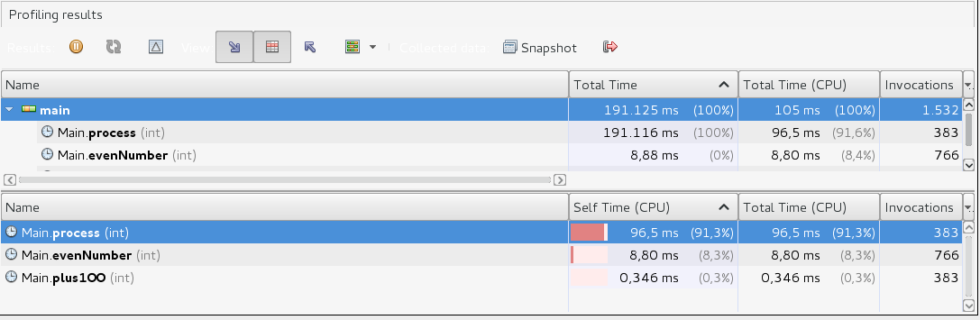

Photo by <a href="https://unsplash.com/@venmer?utm_source=unsplash&utm_medium=referral&utm_content=creditCopyText">Stanislav</a> on <a href="https://unsplash.com/photos/silver-and-white-round-analog-watch-2Yj6MBvJ0sg?utm_source=unsplash&utm_medium=referral&utm_content=creditCopyText">Unsplash</a>

Durante a minha (curta) carreira como programador, raramente tive que otimizar trechos de código para extrair o melhor rendimento possível, acredito que isso se deve principalmente por ter trabalhado em projetos simples, sem tantos requisitos de performance. Ainda assim, acredito que raramente você estará escovando bits. Porém, em situações adversas e com infra limitada, será necessário lutar por milissegundos.

Imagine o seguinte cenário: uma aplicação multithread, que processa milhões de registros diariamente e que deve fazer isso de forma eficiente. Imagine também que escalar verticalmente e/ou horizontalmente não é uma opção neste exemplo, por enquanto aceite que não há mais recursos e que depois de code reviews e algumas otimizações lógicas você tem a sensação de não saber mais o que fazer. E ai?

<!-- truncate -->

Bom, algo similar aconteceu comigo. Como relatei anteriormente, raras as vezes tive que otimizar aplicações para extrair o melhor rendimento, além disso, o fiz em contextos mais simples, não concorrentes. Então estava em uma situação onde o conhecimento e experiência que eu tinha me levaram o mais longe possível.

Aumentar o paralelismo da aplicação já não me parecia a melhor ideia, muito provavelmente devido a deadlocks e starvations, clássicos problemas de programação concorrente. Então, em conversa com outros programadores, decidimos analisar a aplicação com um profiler a fim de encontrar hot spots.

Profilers são tools para análise dinâmica de código, eles funcionam basicamente observando a execução do código de forma a extrair informações, como quantas vezes um trecho foi executado e qual o tempo de execução.

Com esse tipo de ferramenta é possível visualizar os famosos hot spots, ou seja, partes do programa que demoram mais a serem executados ou partes executadas mais frequentemente. Também é possível identificar quais partes do código consomem mais memória, se esse for o caso.

No mundo java, um bom profiler é o visualmv, o qual é enviado juntamente com JDK 6, 7 e 8. Esse profiler instrumenta o código java adicionando bytecodes extras a fim de monitorar a execução. Para executá-lo basta utilizar o comando jvisualvm no terminal.

Caso não queira utilizar a versão enviada juntamente com JDK, você pode fazer o download da última versão [aqui](https://visualvm.github.io/download.html).

Para ilustrar o uso do visualvm, criei um exemplo simples que emula um processamento demorado. Uma simples classe que para cada número par, soma 100 e apresenta no console o resultado. No entanto o último step do processamento é propositalmente lento, pois sem isso não haveria artigo 😂.

Ao executar o visualvm, é possível ver na tela inicial todos os processos java que estão sendo executado na máquina local. Para começar a analisá-los o que você precisa fazer é simplesmente um double click. Com o código de exemplo executando, procure no visualvm um processo chamado Main. Abra o processo, selecione a aba Profiler e depois clique no botão CPU. Nesse momento o visualvm deverá instrumentar o código a fim de começar a registrar os dados necessários. Em aplicações grandes esse processo pode demorar algum tempo, por isso, nas configurações podemos especificar quais classes ou pacotes queremos instrumentar.

Na imagem abaixo é possível perceber que o método ``process`` é responsável pelo maior tempo de CPU mesmo sendo executado metade das vezes do método ``evenNumber``. O que quero ilustrar aqui é o fato de um profiler poder indicar pontos mais específicos, nos quais podemos focar nossos esforços de otimização.

Esse foi exatamente o resultado no projeto que estive envolvido. Após executar o profiler na aplicação identifiquei alguns hot spots que eventualmente foram reescritos para reduzir o tempo de processamento, seja utilizando cache dos resultados de processamentos externos ou reaproveitando objetos caros.

Pessoalmente, não acredito que devemos sair por aí executando profilers em todas as aplicações e otimizando indiscriminadamente algo que funciona muito bem. Devemos otimizar código somente quando for necessário, pois nem toda otimização tem o mesmo ROI, ou seja, algumas otimizações não serão percebidas pelo seu cliente. No entanto, isso não quer dizer que podemos ser desleixados com o código, otimizar o código de certa forma passa naturalmente por conhecer melhor as ferramentas que usamos, como por exemplo saber quando faz sentido usar LinkedList no lugar de ArrayList. De toda maneira, um bom profiler é uma boa opção para se ter na sua caixa de ferramentas, porém nunca esqueça que em muitos casos a otimização prematura é a raiz de todo mal.
