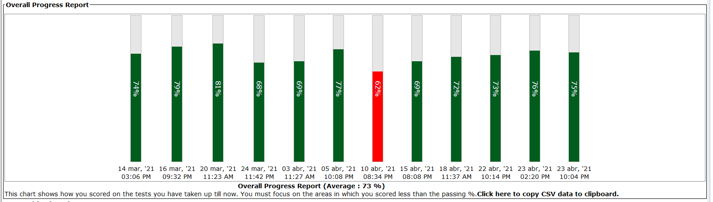

import CallToAction from '@site/src/components/CallToAction';

Recentemente, aproveitando a promoção do 25ª aniversário do Java, atualizei a minha certificação Java 8 para a versão 11 e algumas coisas foram diferentes dessa vez. Não só os novos tópicos incluídos na prova, mas também a forma pela qual optei em fazer o teste.

<!-- truncate -->

## Novos tópicos
Foram removidos da lista de conteúdos, Java SE Date/Time API e o design de classes e padrões de projetos como singleton e classes imutáveis. O primeiro tópico aparece de forma discreta dentro de outros tópicos como Localization. O segundo não aparece. No entanto, para compensar, novos tópicos foram adicionados.

O Java 9 trouxe o mundo modular para a plataforma e essa big feature não estaria de fora de uma certificação Java 11. O exame não cobre todos os aspectos da programação modular e foca apenas em princípios, como definir minimamente um módulo e os comandos necessários para compilar e executar códigos modulares. Essa é uma feature que certamente ditará o rumo do java e você deve focar um tempo nesse assunto de qualquer forma. Um bom material é o capítulo do livro[ Core Java Volume II](https://www.amazon.com/Core-Java-II-Advanced-Features-11th/dp/0135166314) que cobre os principais pontos do sistema de módulos.

Outra novidade do exame é a inclusão da inferência de tipo em variáveis locais e o uso apropriado do `var`. Nesse ponto, o teste espera que você seja capaz de identificar usos incorretos do `var`.

Nas certificações anteriores, era cobrado basicamente o uso de somente uma annotation, `@Override`. Agora, esse tópico foi alargado e nele estão incluídos temas como a correta criação, aplicação e processamento de anotações, além do uso de outras annotations como `@SafeVarags` e `@SuppressWarnings`. 

Além dos tópicos mencionados anteriormente, foi adicionado também uma sessão de codificação segura ou Secure Coding in Java SE Applications. Esse é um tema amplo e importante que merece uma dedicação exclusiva. Você deve esperar pelo menos duas ou três questões sobre segurança. Aqui a certificação foca mais em boas práticas e menos no uso da API. Todo o material necessário para esse tópico pode ser encontrado no Guideline Java. Independentemente, se você pretende se certificar, essa é uma leitura obrigatória e é um tema que ainda aparecerá por aqui. 😀 

  <CallToAction
    title="Secure Coding Guidelines for Java SE"
    description="Saiba mais sobre secure coding na página oficial da Oracle."
    buttonText="Ver guideline"
    buttonLink="https://www.oracle.com/java/technologies/javase/seccodeguide.html"
  />

## A prova
Dessa vez, devido ao contexto atual, não fiz a prova em um test center e optei por tentar de casa. Certamente foi a melhor opção, primeiro porque não precisei me deslocar e segundo porque me senti muito mais confortável. O teste é feito pela PearsonVue também e é necessário baixar o software do exame. Antes do teste, você precisa validar seu computador, webcam, microfone e conexão com internet, que são os itens principais. Sistemas operacionais Linux não são suportados. 

Antes do teste é obrigatório tirar fotos do ambiente e da mesa onde você fará a prova. Sua mesa deve conter somente o computador e não é permitido dois monitores, celulares ou relógios. Minutos antes do início do teste, um “fiscal” entrou em contato por uma chamada através do próprio sistema de certificação e me pediu para ver o ambiente em que eu estava para que pudesse ser novamente validado. Tive que fazer um mini tour pela sala e me comunicar em inglês com o fiscal. Não sei se em outros timezones haverá alguém que fale outras línguas. Mas você deve estar preparado para ao menos entender e atender aos pedidos realizados.

O ponto negativo de não estar em um centro de teste é que nos tornamos responsáveis por coisas importantes que seriam garantidas pelo test center, como um ambiente tranquilo e sem interrupção. Caso opte por esse tipo de teste, escolha um bom lugar e garanta que não será interrompido, pois caso alguém apareça no ambiente enquanto você está realizando a prova, ou vozes sejam ouvidas, é possível que seu teste seja anulado. A webcam fica ligada durante todo o tempo e o teste é gravado. 

Eu não tive muito tempo para me preparar para essa certificação, então acabei por focar nos novos tópicos e revisar os anteriores com simulados. Eu treinei para o exame usando o banco de questões da [Enthuware](https://enthuware.com/), ferramenta que usei também para os testes anteriores. Fiz ao todo 12 simulados com cerca de 50 questões, dos quais falhei somente em um. Esses simulados são mais difíceis do que o teste real, o que ajuda muito na preparação. Como resultado, consegui me certificar com **80%** o que não é mau, embora tenha sido abaixo da minha nota anterior.

  <CallToAction
    title="Java SE 11 Developer Exam Number: 1Z0-819"
    description="Acesse o link abaixo para ver o conteúdo do teste e mais informações sobre a prova."
    buttonText="Ver conteúdo"
    buttonLink="https://education.oracle.com/java-se-11-developer/pexam_1Z0-819"
  />

